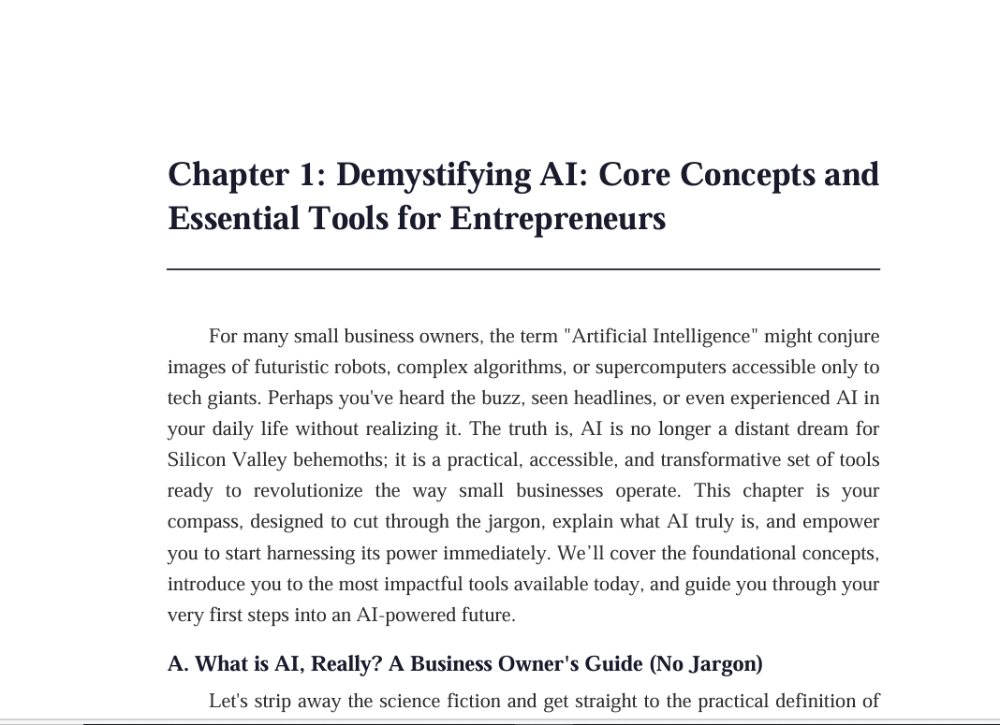
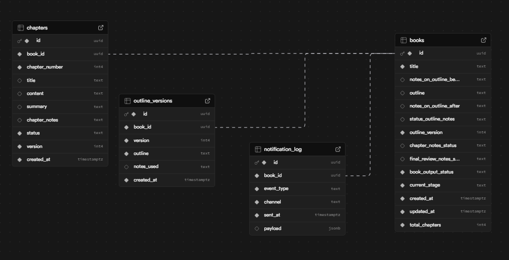

# Automated Book Generation System

A production-grade, AI-powered pipeline that transforms a single Excel row into a fully formatted, publication-ready book — complete with DOCX and PDF export, human-in-the-loop review gates, and automatic notifications.

Built with **Google Gemini 2.5 Flash**, **Supabase**, and a **Finite State Machine** architecture that survives crashes, supports mid-book resume, and scales to multiple books in parallel.

---

## Demo Output



**Generated artifacts include:**

- **Table of Contents**: Dynamic — reflects however many chapters the LLM determines the topic needs
- **Chapters**: 1,500-3,000 words each, context-chained for narrative continuity
- **Formats**: `.docx` (Garamond, Word TOC field) + `.pdf` (ReportLab, chapter dividers, running headers)
- **Storage**: Both files auto-uploaded to Supabase Storage with public URLs persisted to database

---

## Architecture



```
Excel Input (openpyxl)
        │
        ▼
┌─────────────────────────────────────────────────────┐
│                  Orchestrator (FSM)                  │
│                                                      │
│  AWAITING_INPUT → GENERATING_OUTLINE                 │
│       → AWAITING_OUTLINE_REVIEW (human gate)         │
│       → REGENERATING_OUTLINE                         │
│       → GENERATING_CHAPTERS                          │
│       → AWAITING_CHAPTER_REVIEW (human gate)         │
│       → COMPILING → DONE                             │
│       → PAUSED / ERROR                               │
└─────────────────────────────────────────────────────┘
        │
        ├── Stage 1: Input Ingestion      (openpyxl → Supabase)
        ├── Stage 2: Outline Generation   (Gemini → outline_versions)
        ├── Stage 3: Chapter Generation   (context chaining → chapters table)
        └── Stage 4: Compile & Export     (DOCX + PDF → Supabase Storage)
```

### Workflow Visualization

View the complete system workflow on Figma:

[Open Interactive Workflow Board](https://www.figma.com/board/BhXbppyoK7xu7FpZX3zobk/BookGen-AI-workflow?node-id=0-1&t=nyacuSTV5Igkvwlq-1)

### Context Chaining

Every chapter is generated with the **100-word summaries of all previous chapters** injected into the prompt. This keeps narrative continuity across long books without overflowing the context window.

```
Chapter 1 → summary stored
Chapter 2 → summary 1 injected → generated → summary stored
Chapter 3 → summaries 1+2 injected → generated → summary stored
...
Chapter N → summaries 1..N-1 injected → generated
```

### Human-in-the-Loop Gates

The FSM pauses at configurable review points — outline approval, per-chapter feedback, final review — controlled entirely through the Excel input file. No code changes needed to enable or skip review gates.

---

## Tech Stack

| Layer | Technology |
|---|---|
| LLM | Google Gemini 2.5 Flash |
| Database | Supabase (PostgreSQL) |
| Storage | Supabase Storage |
| Input | Excel (openpyxl) |
| DOCX Export | python-docx |
| PDF Export | ReportLab |
| Notifications | SMTP Email + MS Teams Webhook |
| Retry Logic | tenacity (exponential back-off) |
| Config | python-dotenv |

---

## Project Structure

```
book-gen-system/
├── main.py                          # Entry point — daemon or one-shot mode
├── requirements.txt
├── input/
│   ├── books_input.xlsx             # Add book rows here
│   ├── Book-demo.PNG                # Sample output screenshot
│   └── Database-schema.PNG          # Database ERD
├── output/                          # Generated DOCX + PDF land here
├── logs/
│   └── system.log
└── src/
    ├── config.py                    # All env vars validated at startup
    ├── orchestrator.py              # FSM driver — polls Supabase, routes stages
    ├── ai/
    │   ├── llm_client.py            # Gemini wrapper with retry + temperature presets
    │   └── prompts.py               # All prompts in one place — never inline
    ├── stages/
    │   ├── stage1_input.py          # Excel ingestion + Supabase upsert
    │   ├── stage2_outline.py        # Outline generation + version archiving
    │   ├── stage3_chapters.py       # Chapter generation with context chaining
    │   └── stage4_compile.py        # DOCX/PDF export + Storage upload
    ├── exporters/
    │   ├── docx_exporter_pro.py     # Professional DOCX with TOC field
    │   └── pdf_exporter_pro.py      # Professional PDF with cover + chapter dividers
    ├── database/
    │   ├── supabase_client.py       # All DB operations — no raw queries in stages
    │   └── schema.sql               # Full schema with FK constraints + indexes
    └── notifications/
        ├── email_notifier.py        # Email with full DB logging
        └── teams_notifier.py        # MS Teams Adaptive Cards

---

## Database Schema

```sql
books              — FSM state, outline, metadata, total_chapters
chapters           — content, summary, version, status (UNIQUE on book+chapter+version)
outline_versions   — full audit trail of every outline revision
notification_log   — every notification fired, FK to books (CASCADE delete)
```

All foreign keys enforced. `chapters` uses a versioned unique constraint so chapter rewrites never conflict with originals. `total_chapters` is written by Stage 2 immediately after outline parsing — always accurate, never hardcoded.

---

## Quick Start

### 1. Clone & Install

```bash
git clone https://github.com/your-username/book-gen-system.git
cd book-gen-system
pip install -r requirements.txt
```

### 2. Configure Environment

```bash
cp .env.example .env
```

Edit `.env`:

```env
GEMINI_API_KEY=your_gemini_api_key
GEMINI_MODEL=gemini-2.5-flash

SUPABASE_URL=https://your-project.supabase.co
SUPABASE_SERVICE_KEY=your_supabase_service_key

# Optional — email notifications
SMTP_HOST=smtp.gmail.com
SMTP_PORT=587
SMTP_USERNAME=you@gmail.com
SMTP_PASSWORD=your_app_password
NOTIFICATION_FROM=you@gmail.com
NOTIFICATION_TO=recipient@example.com

# Optional — MS Teams notifications
TEAMS_WEBHOOK_URL=https://outlook.office.com/webhook/...

INPUT_EXCEL_PATH=input/books_input.xlsx
OUTPUT_DIR=output
LOG_DIR=logs

LLM_MAX_TOKENS=8192
LLM_TEMPERATURE=1.0
LLM_MAX_RETRIES=3
LLM_RETRY_WAIT_SECONDS=10
```

### 3. Set Up Supabase

Run the schema in your Supabase SQL editor:

```bash
# Paste contents of src/database/schema.sql → Supabase SQL Editor → Run
```

Create a storage bucket named **`book-outputs`** in your Supabase dashboard (Storage → New Bucket → Public).

### 4. Add Your Book to Excel

Open `input/books_input.xlsx` and fill in a row:

| Column | Value | Required |
|---|---|---|
| `title` | Your book title | Yes |
| `notes_on_outline_before` | Instructions for the LLM | Yes |
| `notes_on_outline_after` | Reviewer feedback after seeing outline | No |
| `status_outline_notes` | `no_notes_needed` / `yes` / `no` | Yes |
| `chapter_notes_status` | `no_notes_needed` / `yes` / `no` | Yes |
| `final_review_notes_status` | `no_notes_needed` / `yes` / `no` | Yes |

**For fully automated end-to-end generation** (no human review), set all three status columns to `no_notes_needed`.

### 5. Run

```bash
# Single pass — process all pending books once then exit
python main.py
# Continuous daemon mode — polls every 30 seconds
python main.py --daemon

# Only load Excel input (Stage 1), then exit
python main.py --input-only

# Process a specific book by UUID
python main.py --book-id <UUID>

# Custom poll interval (e.g., 15 seconds)
python main.py --daemon --poll-interval 15
```

---

## Review Gate Workflow

To enable human review at any stage, set the relevant status column to `yes` **before** running:

```
status_outline_notes = yes

→ System generates outline → sends notification → PAUSES
→ You review the outline in Supabase dashboard
→ Add feedback to notes_on_outline_after
→ Set status_outline_notes = no_notes_needed
→ Run python main.py → system regenerates with your notes → continues
```

The same pattern applies to `chapter_notes_status` and `final_review_notes_status`.

---

## Notifications

The system fires notifications at every key FSM transition:

| Event | Trigger |
|---|---|
| `outline_ready` | Outline generated, awaiting review |
| `outline_regenerated` | Outline revised with editor notes |
| `chapter_ready` | Chapter written, awaiting review |
| `system_paused` | Gate hit — human input needed |
| `final_compiled` | Book complete — DOCX + PDF uploaded |
| `error` | Any unhandled exception |

All notifications logged to `notification_log` with full JSONB payload and FK to `books`.

---

## Output Quality

### DOCX

- Garamond font, 1.5 line spacing, justified text, first-line indent
- Word TOC field — press `Ctrl+A → F9` to populate page numbers
- Running book title header, centered page number footer

### PDF

- Times serif, justified body, professional typography
- Geometric navy/gold cover page with concentric rectangles and diagonal patterns
- White center rectangle for clean title display
- Dedicated chapter divider page (full page with "CHAPTER N" and title, no header/footer)
- Running header with separator line, centered page numbers in footer

### Chapter Title Resolution

Raw outline bullets and book-title duplicates are automatically stripped at export time via a 4-step resolver. The TOC always shows clean, meaningful titles regardless of what was stored in the database.

---

## Key Design Decisions

### Why FSM over a linear script?

Linear scripts fail silently mid-book and must restart from scratch. The FSM records state after every stage — a crash at chapter 7 resumes at chapter 7, not chapter 1.

### Why context chaining instead of full chapter text?

Injecting all previous chapters into each prompt would overflow the context window by chapter 4-5. 100-word summaries preserve narrative continuity at roughly 2% of the token cost.

### Why dynamic chapter count?

A hardcoded "8-12 chapters" instruction produces padded or truncated books. The prompt instructs the LLM to decide based on topic scope, enforces `Chapter N: Title` format for reliable parsing, and stores the real count in `total_chapters` immediately after outline generation.

### Why Supabase?

Real-time visibility during demos, built-in Storage for file hosting, and a proper relational schema with FK constraints — not a JSON blob in a NoSQL store. The `outline_versions` table gives a full audit trail; the `notification_log` gives operational observability.

---

## FSM State Machine

```
AWAITING_INPUT
  → GENERATING_OUTLINE         (notes_on_outline_before present)

GENERATING_OUTLINE
  → AWAITING_OUTLINE_REVIEW    (status_outline_notes = 'yes')
  → GENERATING_CHAPTERS        (status_outline_notes = 'no_notes_needed')
  → PAUSED                     (status_outline_notes = 'no' or null)

AWAITING_OUTLINE_REVIEW
  → REGENERATING_OUTLINE       (notes_on_outline_after added)
  → GENERATING_CHAPTERS        (status_outline_notes = 'no_notes_needed')

REGENERATING_OUTLINE
  → AWAITING_OUTLINE_REVIEW    (after regeneration, awaits next review)

GENERATING_CHAPTERS
  → AWAITING_CHAPTER_REVIEW    (chapter_notes_status = 'yes')
  → COMPILING                  (all chapters complete + final_review_notes_status = 'no_notes_needed')
  → PAUSED                     (chapter_notes_status = 'no' or null)

COMPILING
  → DONE

PAUSED
  → (re-evaluated on next tick when human updates database fields)

ERROR
  → PAUSED (manual intervention needed; check logs/system.log)
```

### State Transitions

The system evaluates three key review gates:

1. **Outline Review** — Set `status_outline_notes = 'no_notes_needed'` to proceed, or add text to `notes_on_outline_after` to trigger regeneration
2. **Chapter Review** — After each chapter when `chapter_notes_status = 'yes'`. Add notes to `chapters.chapter_notes` to revise, or set `chapter_notes_status = 'no_notes_needed'` to continue
3. **Final Review** — After all chapters. Set `final_review_notes_status = 'no_notes_needed'` to compile

---

## Environment Variables Reference

| Variable | Description | Required |
|---|---|---|
| `GEMINI_API_KEY` | Google Gemini API key | Yes |
| `GEMINI_MODEL` | Model name (e.g., `gemini-2.5-flash`) | Yes |
| `SUPABASE_URL` | Supabase project URL | Yes |
| `SUPABASE_SERVICE_KEY` | Supabase service role key | Yes |
| `SMTP_HOST` | SMTP server (default: smtp.gmail.com) | No |
| `SMTP_PORT` | SMTP port (default: 587) | No |
| `SMTP_USERNAME` | SMTP login email | No |
| `SMTP_PASSWORD` | SMTP app password | No |
| `NOTIFICATION_FROM` | Sender email address | No |
| `NOTIFICATION_TO` | Notification recipient email | No |
| `TEAMS_WEBHOOK_URL` | MS Teams incoming webhook URL | No |
| `INPUT_EXCEL_PATH` | Path to input file (default: `input/books_input.xlsx`) | No |
| `OUTPUT_DIR` | Output directory (default: `output`) | No |
| `LOG_DIR` | Log directory (default: `logs`) | No |
| `LLM_MAX_TOKENS` | Maximum tokens per LLM call (default: 8192) | No |
| `LLM_TEMPERATURE` | LLM temperature (default: 1.0) | No |
| `LLM_MAX_RETRIES` | Number of retry attempts (default: 3) | No |
| `LLM_RETRY_WAIT_SECONDS` | Wait time between retries (default: 10) | No |

---

## Requirements

- Python 3.11+
- `google-genai` (migrated from deprecated `google-generativeai`)
- `supabase`, `openpyxl`
- `python-docx`, `reportlab`
- `tenacity`, `python-dotenv`, `httpx`

Install all dependencies:

```bash
pip install -r requirements.txt
```

---

## Resumability

If the system crashes at any point:

1. Chapters already generated remain in Supabase with `status = 'generated'`
2. Re-run `python main.py` — the orchestrator reads current database state and resumes from the first pending chapter
3. No previously generated content is overwritten

The FSM ensures zero data loss and seamless continuation after any interruption.

---

## Testing

```bash
pytest tests/ -v
```

All tests use mocks — no real API calls are made during test execution.

---

## Code Quality Standards

- Every function and module has comprehensive docstrings
- All logging uses Python's `logging` module (never `print`)
- Logs go to both console and `logs/system.log`
- All Supabase calls wrapped in try/except with error logging
- Credentials never appear in code — only in `.env`
- `@dataclass` used for all data models (`Book`, `Chapter`, `OutlineVersion`)
- Type hints throughout codebase
- Single responsibility principle — each module has one clear purpose

---

## License

MIT — free to use, modify, and distribute.

---

**Built as a demonstration of production-grade AI engineering:** crash-safe FSM architecture, context-aware LLM chaining, human-in-the-loop workflow design, versioned audit trails, professional document export, and operational observability.